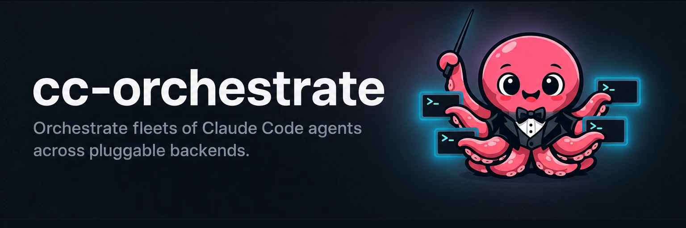
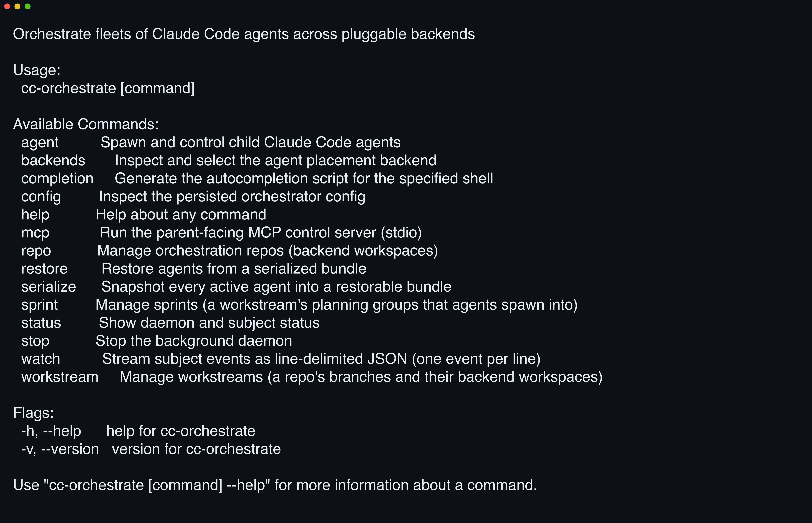

# 

**Stop letting your Claude agents fight over one working copy.** cc-orchestrate cuts a fresh worktree per workstream and spawns Claude agents across five backends, all driven from one CLI or 19 MCP tools.

[](https://github.com/yasyf/cc-orchestrate/actions/workflows/ci.yml)
[](https://github.com/yasyf/cc-orchestrate/releases)
[](LICENSE)

## Get started

```bash
brew install --cask yasyf/tap/cc-orchestrate
cco --help
```



The cask installs `cc-orchestrate` plus a `cco` alias for the same binary; this README uses `cco`.

Driving with an agent? Paste this:

```text
/plugin marketplace add yasyf/cc-orchestrate
/plugin install cc-orchestrate@cc-orchestrate
```

The plugin loads the command surface into context and registers `/cc-orchestrate`, so Claude drives the fleet with the `cco` CLI directly.

---

## Use cases

### Work three branches at once without agents clobbering each other's checkout

Two agents editing one checkout stomp each other's files and race on the git index. Give each stream of work its own worktree, then spawn into it:

```bash
cco repo create demo --cwd .
cco workstream create feat-x --repo demo
cco agent spawn --workstream feat-x --name a1 --prompt "summarize the repo and wait"
```

`agent spawn` places the agent in a fresh terminal on the selected backend and prints where it landed:

```
agent:    a1f3c2
backend:  tmux
terminal: feat-x:0.0
```

Repeat `workstream create` per branch. Agents inside a workstream share its worktree; no two workstreams ever share one.

### Drive the whole fleet from a parent Claude session over MCP

Orchestrating by hand makes you the router between terminal tabs. Register the control server in the parent session's `.mcp.json` and hand the fleet to Claude:

```json
{
  "mcpServers": {
    "cc-orchestrate": {
      "command": "cc-orchestrate",
      "args": ["mcp"]
    }
  }
}
```

The server exposes one request/response tool per orchestration op, named by entity from `backends_list` and `repo_create` through `agent_spawn` and `fleet_restore`. `agent_list` and `agent_show` return point-in-time snapshots, so run `cco agent watch` under a monitor alongside the MCP session for live status.

### Snapshot tonight's running fleet and restore it tomorrow

Closing your laptop at 6pm shouldn't cost you the fleet. Serialize every active agent into a bundle, then rehydrate from it:

```bash
cco serialize
# the next morning
cco restore ~/.cc-orchestrate/serialize/20260702T180000Z.json
```

`serialize` prints `serialized 3 agent(s) to <bundle>`. `restore` re-inserts any missing rows and resumes each agent's session into a fresh backend terminal.

## The model

cc-orchestrate models the work as a four-level tree, so isolation is structural, not conventional:

```
repo            a git repository
└─ workstream   a git worktree on its own branch — the unit of isolation
   └─ sprint    a grouping of agents that shares the workstream's worktree
      └─ agent  one spawned Claude Code session
```

- A **backend** is the runtime that places and spawns agents, a terminal multiplexer
  or workspace manager. cc-orchestrate uses the first installed of herd, superset,
  cmux, zellij, and tmux, in that order; `backends select` pins one.
- A **repo** is a git repository cc-orchestrate tracks. Creating a repo records it and
  provisions a *primary* workstream over the repo's existing checkout, with a default
  sprint, so the single-stream flow needs no extra steps.
- A **workstream** is one git worktree on its own branch, strictly one worktree per
  workstream and never per agent. It owns the backend workspace agents spawn into.
- A **sprint** is a grouping of agents inside a workstream. Every workstream gets a
  default sprint, so you only reach for sprints to slice a workstream's agents into
  named batches.
- An **agent** is one spawned Claude Code session, a cc-interact subject keyed by its
  `--session-id`. Its status, messages, and reports flow through the subject's event log.
- The **daemon** is a lazy, auto-started process that owns all repo, workstream,
  sprint, agent, and config state in SQLite under `~/.cc-orchestrate` and tails each
  agent's transcript. The CLI starts it on first use; you never launch it by hand.

## Commands

cco groups its surface by what you're orchestrating. Run any command with `--help` for
its flags.

| Command | What it does |
| --- | --- |
| `backends list` / `select <backend>` | Show installed runners; pin the default. |
| `config get <key>` | Read `backend`, `active-repo`, `active-workstream`, or `active-sprint` from the persisted config. |
| `repo list` / `create` / `activate` / `kill` | Manage repos; kill cascades to the repo's workstreams, sprints, and agents. |
| `workstream list` / `create` / `activate` / `kill` | Manage worktrees (alias `ws`); kill removes the worktree and its backend workspace. |
| `sprint list` / `create` / `activate` | Slice a workstream's agents into named batches. |
| `agent spawn` | Spawn a Claude agent into the targeted repo, workstream, or sprint. |
| `agent list` / `status <id>` | Point-in-time snapshot of the fleet or one agent. |
| `agent send-message <id> "text"` / `kill <id>` | Push an instruction to a running agent, or stop it. |
| `agent watch --all` / `--id <id>` | Stream agent events as line-delimited JSON. |
| `serialize` / `restore <bundle>` | Snapshot every active agent into a bundle; rehydrate the fleet from one. |
| `mcp` | Run the parent-facing MCP control server over stdio. |

The active repo, workstream, and sprint target a bare `agent spawn`; each `activate`
resets the more-specific selections, and killing an active entity clears its selection.
Beneath the domain commands, cco re-exposes cc-interact's `status`, `stop`, and
`watch`, plus hidden plumbing; the daemon auto-starts, so you rarely touch any of it.

## How it works

cc-orchestrate builds on [cc-interact](https://github.com/yasyf/cc-interact), which
supplies the lazy daemon, the append-only SQLite event log, and the MCP channel;
cc-orchestrate adds repos, workstreams, sprints, agents, and the five backend drivers
on top. The one-worktree-per-workstream invariant holds no matter how a backend
behaves. cc-orchestrate adopts the path superset reports or runs `git worktree add` itself under
`~/.cc-orchestrate/worktrees/`, and colocates an independent jj repo on Jujutsu
checkouts. The mechanics live in [AGENTS.md](AGENTS.md).

## cc-notes integration

When a repo already uses [cc-notes](https://github.com/yasyf/cc-notes), cc-orchestrate
mirrors its tree into cc-notes entities. A workstream becomes a cc-notes project, a
sprint becomes a cc-notes sprint, and each spawned agent becomes a cc-notes task tagged
with the workstream's branch. The cc-notes library is linked and driven in-process, so
there's no `cc-notes` binary to install for the integration to run.

The binding is gated on the repo already holding cc-notes entities under
`refs/cc-notes/*`, so repos that don't use cc-notes spawn exactly as before. Opt a
repo in by creating cc-notes entities in it with the cc-notes CLI; from then on
cc-orchestrate keeps the two trees in sync.

Licensed under [PolyForm Noncommercial 1.0.0](LICENSE).
